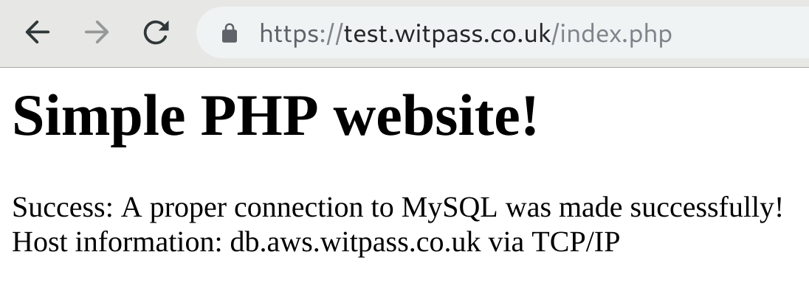

# Simple/test PHP website
This is a very simple website with some simple files, just to test PHP/web server functionality, etc. 

With this simple repository, I can avoid creating files manually, while conducting demos. This repository can simply be cloned into the document root of a webserver, which you will access to verify that the webserver is working properly. 

I can:
* show that I can access an `index.html` page on a web server (Apache, Nginx, etc)
* access `index.php` , which will show that PHP parser mechanism is working
* access `phpinfo.php` to see what PHP settings are configured on a particular web server
* access `createfile.php` to see if the webserver can create a file inside web server's DocumentRoot
* set this repo/directory as mounted volume inside a dockerized web server, either through `docker run` or `docker-compose`
* show how you can use environment variables loaded from a certain ENV file, which can be used inside your PHP scripts/programs

**Note:** The files are under the directory named `website/` .


# Example of using environment variables inside PHP scripts:
The environment variables should be in the file called `website.env` , with each VARIABLE=VALUE pair on a separate line. The VALUE of any VARIBALE **must not** be enclosed in single of double quotes. Here is an example:

```
$ cat website.env

DB_SERVER=db.aws.wbitt.com
DB_NAME=db_test
DB_USER=user_test
DB_PASSWORD=Some-Secret-Password
```
**Note:** The file `website.env` is (should be) **git-ignored** , so you don't accidentally expose your secrets through your code. Actually all `*.env` files are git-ignored in this repository.

**Note:** The `docker-compose.yml` file contains few traefik/reverse-proxy related lines of configuration, which the developers of different applications can adjust to suit their needs.

# Successful run:


